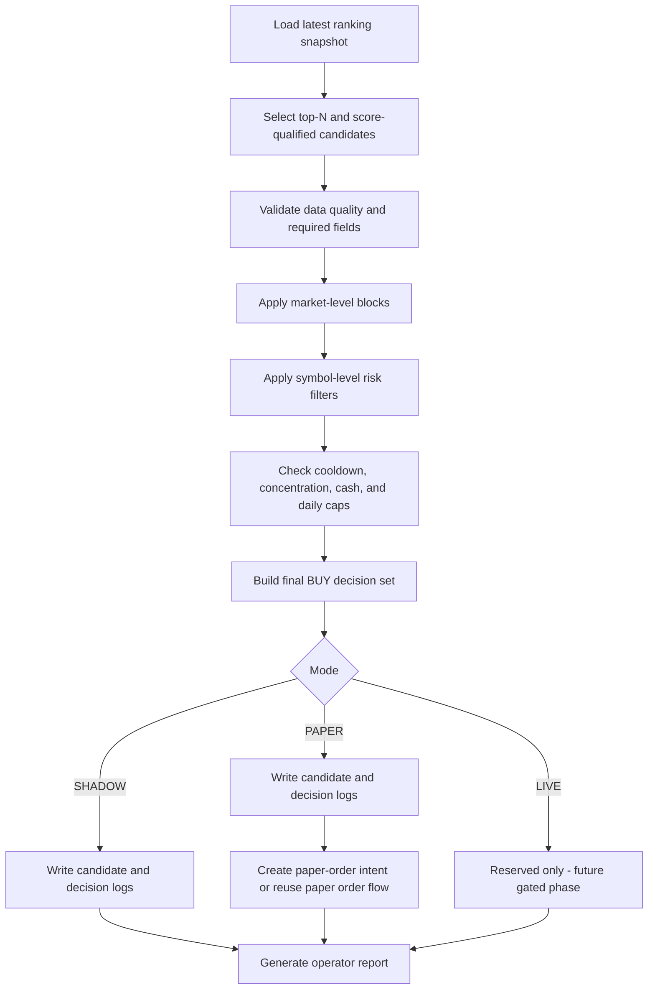

# Limited BUY Automation Design

> 문서 역할: `현재 기준 문서`
>
> Phase 8-1은 실매매 BUY 구현이 아니라, 제한적 BUY 자동화를 어떤 조건에서만 허용하고 어떤 조건에서는 기본 차단할지 설계하는 단계다.

## Purpose

This document defines the Phase 8-1 design for limited US-stock BUY automation.

The goal is not to connect directly to broker execution. The goal is to define:

- BUY eligibility rules
- BUY blocking rules
- SHADOW / PAPER / LIVE operating modes
- required ENV structure
- candidate / decision / paper-tracking table design
- reporting and operator review requirements
- conservative LIVE transition criteria

## Missing Baseline Documents

The original work request referenced the following baseline documents:

- `doc/modules/Lee_trader_us/CONTEXT.md`
- `doc/modules/Lee_trader_us/ARCHITECTURE.md`
- `doc/modules/Lee_trader_us/ENV.md`
- `doc/modules/Lee_trader_us/OPERATIONS.md`
- `doc/modules/Lee_trader_us/DB_SCHEMA.md`

Current state at Phase 8-1 start:

- `CONTEXT.md` exists
- `ENV.md` exists
- `OPERATIONS.md` exists
- `ARCHITECTURE.md` is missing
- `DB_SCHEMA.md` was missing and is added in this phase

Until a dedicated `ARCHITECTURE.md` is added, use `FLOW.md` + `CONTEXT.md` as the architecture boundary reference.

## Current System Boundary

Phase 7 finished the following:

- ranking and Top-N review
- backtest and forward-test research paths
- paper-trading order/fill/account structure
- live safety policy, pre-trade check, kill switch, and approval flow
- Micro Live order request, sync, reconciliation, and daily operations reporting

What does not exist yet:

- unrestricted live auto-trading
- direct BUY execution automation
- automatic sell automation
- automatic retry/reorder logic
- automatic broker-state overwrite or correction orders

Phase 8-1 must preserve that boundary.

## Non-Goals

Phase 8-1 does not do the following:

- implement real BUY order submission
- call broker APIs
- activate LIVE mode
- add a scheduler that can place orders
- auto-correct blocked or mismatched states with trading
- relax Phase 6 / Phase 7 safety gates

## Design Principles

### Fail-Safe First

If the system is uncertain, incomplete, stale, or inconsistent, the result must be `BLOCK`, not `ALLOW`.

### BUY-Only And Small-Scope

The first automation step is limited BUY candidate selection only.

- no sell automation expansion
- no portfolio-wide rebalance automation
- no intraday chase logic
- no multi-order burst logic

### Explicit Mode Separation

The same candidate-evaluation flow can feed multiple operating modes, but the outcome handling must remain separate:

- SHADOW: evaluate only
- PAPER: create virtual orders only
- LIVE: reserved for a future gated phase only

### Traceability Over Aggression

Every candidate must leave an audit trail that explains:

- why it was considered
- why it was allowed or blocked
- which rule fired
- which mode handled it
- what the operator still needs to review

## BUY Allow Conditions

The following conditions are recommended as the Phase 8 baseline. The list is split into conditions that can be enforced immediately with current data and conditions that should remain future extensions.

### Immediately Enforceable Conditions

These conditions are already supported or can be derived from existing ranking, universe, feature, paper, and live-safety structures.

1. Candidate must exist in `recommend.us_stock_rank_daily`.
2. Candidate must be inside ranking Top N.
3. Candidate must satisfy a minimum `recommend_grade` threshold such as `BUY` or better.
4. Candidate must satisfy a minimum `total_score` threshold.
5. Candidate must belong to an active symbol in `meta.us_stock_universe`.
6. Candidate must not be leveraged or inverse ETF when those safety blocks are enabled.
7. Candidate must satisfy the current price floor/ceiling policy.
8. Candidate must satisfy minimum liquidity requirements using existing universe / price data.
9. Candidate must have no critical data-quality warning for required inputs.
10. Candidate must pass the existing Phase 6 pre-trade safety gates before it can be considered operationally eligible.
11. Candidate must respect daily count, daily notional, and per-symbol notional caps.
12. Candidate must respect cooldown rules for recent repeat buys.
13. Candidate must not already have an active same-day candidate or paper/live request in a conflicting state.

### Conditionally Enforceable Now With Conservative Approximation

These can be partially supported now, but the implementation basis should be documented as approximate until dedicated fields are formalized.

1. Relative-strength requirement using existing `feature.us_stock_relative_strength_daily`.
2. Volatility ceiling using current daily return/volatility features.
3. Existing-holding duplicate-buy restriction using paper position state or future live-position mirror.
4. Sector concentration rule using `meta.us_stock_universe.sector`.
5. Gap-up and intraday chase block using daily/open-close derived proxies if a same-day intraday feed is not available.

### Future-Feature Conditions

These should be documented but not treated as reliable in Phase 8-1 without additional data layers.

1. Probability threshold from ML model output.
2. Event-risk exclusion using earnings calendar data.
3. VIX-based hard blocks if no official VIX data integration exists yet.
4. Intraday volatility proxy requiring sub-daily feed.
5. Broker-account cash/position-aware live sizing without a dedicated live account-state layer.

## BUY Block Conditions

All block conditions follow fail-safe behavior.

### Market-Level Hard Blocks

1. `SPY` drawdown exceeds configured block threshold.
2. `QQQ` drawdown exceeds configured block threshold.
3. benchmark market regime is `BEAR_HIGH_VOL` or equivalent blocked regime.
4. benchmark data is missing, stale, or inconsistent.
5. volatility proxy is above allowed threshold.

### Symbol-Level Hard Blocks

1. candidate price is outside allowed range
2. candidate is leveraged or inverse ETF
3. required financial / feature / ranking inputs are missing
4. candidate rank or score is below threshold
5. gap-up exceeds configured maximum
6. intraday or recent move exceeds configured chase threshold
7. recent symbol volatility exceeds configured ceiling
8. same symbol was bought within cooldown days
9. symbol already has pending approval or open order state that should prevent duplicate buy flow

### Portfolio / Account Hard Blocks

1. daily buy count cap reached
2. daily buy notional cap reached
3. per-symbol buy notional cap reached
4. sector concentration cap would be exceeded
5. cash is insufficient
6. live or paper position concentration cap would be exceeded

### Operational Hard Blocks

1. pre-trade check returns `BLOCK`
2. pre-trade check returns `ERROR`
3. kill switch is active
4. approval is required but missing
5. approval is expired
6. ranking snapshot for the date is missing
7. market data freshness check failed
8. risk or decision logging failed
9. any required table read failed

### Mandatory Default On Uncertainty

The following cases must default to `BLOCK`:

- unknown market state
- missing score input
- stale benchmark data
- stale position/cash state
- incomplete cooldown history
- duplicated candidate rows
- DB or API read timeout

## Operating Modes

## SHADOW

Purpose:

- evaluate BUY eligibility without creating any order artifact that could be mistaken for execution

Runs:

- load ranking snapshot
- apply candidate filters
- apply blocking rules
- create candidate and decision logs
- generate daily operator report

Does not run:

- approval-to-order creation
- paper order creation
- broker calls
- real order submission

Primary tables:

- `trade.us_buy_candidate_log`
- `trade.us_buy_decision_log`
- optionally `trade.us_risk_guard_log`

Required ENV:

- `US_BUY_AUTOMATION_MODE=SHADOW`
- `US_BUY_AUTOMATION_ENABLED=false` by default

Operator review focus:

- how many candidates survive filtering
- whether block reasons are sensible
- whether fail-safe behavior is too loose or too strict

Promotion criteria to PAPER:

- at least 20 US trading days of stable SHADOW evaluation
- no unexplained duplicate candidates
- no missing log coverage
- market-block rules reviewed and accepted

## PAPER

Purpose:

- turn approved BUY decisions into virtual paper orders and track simulated outcomes

Runs:

- all SHADOW evaluation steps
- create paper-order intent rows
- reuse or integrate with `paper.us_stock_paper_order`
- produce paper performance / exposure reporting

Does not run:

- broker submission
- real balance mutation
- LIVE mode transitions

Primary tables:

- `trade.us_buy_candidate_log`
- `trade.us_buy_decision_log`
- `trade.us_risk_guard_log`
- `paper.us_stock_paper_order`
- `paper.us_stock_paper_fill`
- `paper.us_stock_paper_position`

Required ENV:

- `US_BUY_AUTOMATION_MODE=PAPER`
- `US_PAPER_TRADING_ENABLED=true`
- `US_PAPER_REAL_ORDER_BLOCKED=true`

Operator review focus:

- paper fill behavior
- duplicate-buy prevention
- daily cap enforcement
- paper PnL vs benchmark

Promotion criteria to LIVE review:

- at least 60 US trading days of PAPER operations
- paper results are stable and benchmark-comparable
- no repeated fail-safe miss
- no unresolved block-rule gaps

## LIVE

Purpose:

- future gated operational mode for real BUY orders

Phase 8-1 status:

- not implemented
- not activatable
- documented only

Future requirements:

- all Phase 6 and Phase 7 gates remain in force
- manual approval remains mandatory
- explicit live account state validation is available
- reconciliation and operations reporting are stable

Does not run in Phase 8-1:

- real-order creation
- broker submission
- scheduler activation

## Proposed BUY Decision Flow



## Reporting And Operator View

The future daily BUY automation report should show the following fields.

### Candidate Summary

- trade date
- mode
- ranking source
- number of ranked symbols reviewed
- number of candidates passing first-stage filters
- number of final allowed BUY candidates
- number of blocked candidates

### Candidate Detail

- symbol
- company name
- sector
- rank
- recommend grade
- total score
- relative-strength fields used
- volatility fields used
- current price reference
- candidate amount USD
- allow/block decision
- top blocking reason
- all applied rule tags

### Market Guard Summary

- SPY daily move
- QQQ daily move
- regime label
- volatility proxy status
- market block flag
- market block reason

### Portfolio / Exposure Summary

- daily buy count used
- daily buy amount used
- per-symbol notional used
- sector exposure estimate
- cooldown violations

### PAPER Tracking Fields

- paper order id
- simulated order price
- simulated fill status
- paper position change
- paper cumulative return

### LIVE Readiness Fields

- live enabled flag
- real-order blocked flag
- manual approval required flag
- kill-switch active flag
- latest reconciliation status
- operator readiness verdict

## ENV Design

The detailed ENV list is added in `ENV.md`. At a design level, the variables should be grouped like this.

### Immediately Usable ENV

- mode switch
- enabled flag
- top-N threshold
- minimum grade / score
- daily count cap
- daily amount cap
- per-symbol amount cap
- price floor / ceiling
- volatility ceiling
- cooldown days
- fail-safe on data error

### Future-Feature ENV

- probability threshold
- earnings-event blackout window
- VIX hard-block threshold
- intraday chase threshold based on sub-daily data
- live account equity-aware sizing

### LIVE-Only ENV

- explicit live buy enable
- explicit live approval policy
- live cash floor from reconciled account state
- live broker account reference
- live shadow-to-order release control

## Proposed Tables

The detailed table summary and DDL sketches are added in `DB_SCHEMA.md`.

At the design level, Phase 8-1 proposes:

### `trade.us_buy_candidate_log`

Purpose:

- store every symbol that entered the BUY review funnel before final allow/block decision

### `trade.us_buy_decision_log`

Purpose:

- store final allow/block decision with rule details and operator-review context

### `trade.us_risk_guard_log`

Purpose:

- store market-level and portfolio-level guard evaluations so operator reports can explain global blocks separately from symbol blocks

### Optional Integration Principle

Paper execution artifacts should continue to use existing `paper.us_stock_paper_*` tables rather than inventing duplicate paper-order structures unless a thin intent table is needed for traceability.

## LIVE Transition Conditions

LIVE is not automatic. LIVE is only a future gated promotion after explicit operator review.

Recommended minimum conditions:

1. SHADOW mode runs cleanly for at least 20 US trading days.
2. PAPER mode runs cleanly for at least 60 US trading days.
3. no repeated unexplained candidate duplication
4. no repeated fail-safe miss under missing/stale data scenarios
5. paper performance is reviewed against benchmark and risk constraints
6. daily caps and cooldown rules behave exactly as designed
7. pre-trade check remains mandatory
8. manual approval remains mandatory
9. kill switch activation path is verified
10. reconciliation critical events are not recurring
11. operator signs off manually

Required policy sentence:

Phase 8 is not full auto-trading. Phase 8 is a limited, tightly gated BUY automation stage built on top of the Phase 6 and Phase 7 safety layers.

## Recommended Next Implementation Phase

Phase 8-2 should implement SHADOW mode only.

Recommended scope:

- candidate selection runner
- candidate / decision logging
- daily BUY automation report
- no order creation
- no broker calls
- no LIVE activation

That keeps the first implementation step aligned with the Phase 8-1 safety design.

## Phase 8-2 Implemented Skeleton

Phase 8-2 now adds a non-broker BUY automation skeleton.

Implemented modules:

- `python/us/buy_automation/config.py`
- `python/us/buy_automation/candidate_loader.py`
- `python/us/buy_automation/risk_guard.py`
- `python/us/buy_automation/decision_engine.py`
- `python/us/buy_automation/paper_order.py`
- `python/us/buy_automation/logger.py`
- `python/us/buy_automation/run_us_buy_automation.py`
- `python/us/run_us_buy_automation.py`
- `scripts/run_us_buy_automation.py`

Current behavior:

- reads the latest ranking snapshot
- selects Top-N BUY review candidates
- applies fail-safe risk-guard checks
- records SHADOW or PAPER decision artifacts
- never calls a broker API
- never places a real order
- blocks `LIVE` mode with `LIVE_NOT_IMPLEMENTED`

## Execution

Actual project command:

```powershell
python -m python.us.buy_automation.run_us_buy_automation
python scripts/run_us_buy_automation.py
python scripts/run_us_buy_automation.py --trade-date 2026-05-14 --account-id US_BUY_SHADOW
```

Console output includes:

- mode
- enabled flag
- effective trade date
- loaded / allowed / blocked candidate counts
- paper order count
- block summary

## SHADOW / PAPER / LIVE Difference In Phase 8-2

### SHADOW

- evaluates candidates
- writes decision logs / JSON output
- does not create paper orders

### PAPER

- evaluates candidates
- creates internal paper-order records only
- does not touch broker or real account flow
- DB table write is optional and only happens if `trade.us_paper_order` already exists

### LIVE

- parsed as a mode for completeness only
- always blocked with `LIVE_NOT_IMPLEMENTED`
- no live order path exists in Phase 8-2

## Logging And Output

Primary behavior:

- JSON run artifact is written under `US_BUY_REPORT_OUTPUT_DIR`
- DB writes are attempted only if the proposed `trade.*` tables already exist
- missing tables fall back gracefully to JSON-only output

Tracked fields include:

- trade date
- mode
- symbol
- rank
- score
- probability
- allowed / blocked
- block reasons
- applied rules
- allocated amount
- paper-order record

## Known Limitations

1. current ranking rows do not expose a stable probability field, so `US_BUY_MIN_PROB > 0` will usually block candidates unless future data is added
2. gap-up / intraday checks use daily price history only, not intraday feed data
3. cooldown history uses existing paper / approval / micro-order tables when available, not a dedicated BUY automation history table yet
4. `trade.us_paper_order` is a Phase 8 skeleton log table and is separate from the older `paper.us_stock_paper_order` lifecycle
5. no scheduler integration is added
6. no migration is auto-applied

## Next TODO

Phase 8-3 should focus on:

- stabilizing SHADOW reports
- applying DDL manually after review
- adding richer candidate reporting
- deciding whether Phase 8 PAPER should reuse `paper.us_stock_paper_order` directly or keep `trade.us_paper_order` as a separate intent log
- preparing stricter benchmark / market-regime guards with explicit market-state inputs

## Phase 8-3 Report And Validation Layer

Phase 8-3 adds an operator-facing review layer on top of the Phase 8-2 skeleton.

Implemented modules:

- `python/us/buy_automation/report_generator.py`
- `python/us/buy_automation/validation_summary.py`
- `python/us/buy_automation/paper_performance.py`
- `python/us/buy_automation/notification_formatter.py`
- `python/us/buy_automation/run_us_buy_report.py`
- `python/us/run_us_buy_report.py`
- `scripts/run_us_buy_report.py`

## Phase 8-3 Execution

```powershell
python scripts/run_us_buy_automation.py
python scripts/run_us_buy_report.py --format console
python scripts/run_us_buy_report.py --trade-date 2026-05-11 --format json
python scripts/run_us_buy_report.py --trade-date 2026-05-11 --format markdown
```

## Report Output Structure

### Console

- trade date
- mode
- enabled flag
- loaded / allowed / blocked counts
- paper order count
- amount / symbol usage ratio
- block summary
- rule summary

### JSON

Stored under `reports/lee_trader_us/buy_automation/`.

Main fields:

- `report_generated_at`
- `trade_date`
- `mode`
- `automation_enabled`
- `loaded_candidates`
- `allowed_candidates`
- `blocked_candidates`
- `paper_order_count`
- `final_candidates`
- `blocked_candidates_detail`
- `validation_summary`
- `paper_performance`
- `fail_safe_triggered`
- `live_transition_readiness`

### Markdown

Stored under `reports/lee_trader_us/buy_automation/`.

Main sections:

- overview
- daily summary
- block summary
- allowed candidates
- blocked candidates
- validation notes
- paper performance
- limitations

## Block Summary Interpretation

- `AUTOMATION_DISABLED`: evaluation ran but release stayed blocked by master gate
- `DATA_MISSING` or `*_MISSING`: fail-safe block because required evidence was incomplete
- `INVALID_DECISION_LOG`: blocked candidate had no block reason and the log should be reviewed
- `REPORT_PARSE_ERROR`: applied rule or block-reason structure could not be read safely
- `LIVE_NOT_IMPLEMENTED`: `LIVE` mode was requested but is intentionally blocked

## PAPER Performance Tracking

Current Phase 8-3 method:

- base input is Phase 8 PAPER virtual order rows only
- no real fill, broker fill, or account position is used
- buy price uses `assumed_fill_price` or `paper_order_price`
- latest price uses daily close history only
- benchmark return uses `US_BUY_BENCHMARK_SYMBOL`, default `SPY`
- excess return = paper unrealized return minus benchmark return

Current limitations:

- no fee, tax, FX, or slippage adjustment
- no intraday mark price
- if price history is incomplete, status becomes `PRICE_DATA_MISSING`

## Important Boundary

Phase 8-3 reporting is not a LIVE readiness decision engine.

- LIVE transition readiness remains `NOT_EVALUATED`
- the report supports operator review
- the report must not be treated as permission to activate LIVE trading

## Phase 8-4 Scheduler Integration

Phase 8-4 connects the BUY automation skeleton to a daily automated review path without enabling real trading.

Implemented modules:

- `python/us/buy_automation/scheduler_job.py`
- `python/us/run_us_buy_scheduler_job.py`
- `scripts/run_us_buy_scheduler_job.py`

Integrated pipeline hook:

- `python/us/run_us_daily_pipeline.py`

### Execution Order

Current intended order:

1. upstream US data collection and feature generation
2. ranking / score snapshot generation
3. BUY automation scheduler job
4. BUY report generation
5. operator review

Current implementation note:

- the BUY scheduler hook is attached after the feature stage in `run_us_daily_pipeline.py`
- if ranking data is absent, the job records `SOURCE_DATA_MISSING` or `NO_CANDIDATE`
- this is treated as a review-stage outcome, not a broker execution failure

### Scheduler ENV

Phase 8-4 adds:

- `US_BUY_SCHEDULER_ENABLED`
- `US_BUY_SCHEDULER_RUN_AUTOMATION`
- `US_BUY_SCHEDULER_RUN_REPORT`
- `US_BUY_SCHEDULER_FAIL_PIPELINE_ON_ERROR`
- `US_BUY_SCHEDULER_ALLOW_LIVE`
- `US_BUY_SCHEDULER_TRADE_DATE`
- `US_BUY_SCHEDULER_MAX_RUNTIME_SECONDS`
- `US_BUY_SCHEDULER_LOG_LEVEL`

### SHADOW / PAPER Only

Scheduler integration rules:

- `SHADOW`: evaluate and report only
- `PAPER`: evaluate, create virtual paper-order artifacts, and report
- `LIVE`: blocked in scheduler with `LIVE_DISABLED_IN_SCHEDULER`

### Failure Behavior

Default behavior:

- catch BUY automation exceptions
- catch BUY report exceptions
- return structured error summary
- do not fail the parent pipeline unless explicitly configured

Optional stricter behavior:

- `US_BUY_SCHEDULER_FAIL_PIPELINE_ON_ERROR=1`
- raises the scheduler failure to the caller

### Report Location

Scheduler runs should leave:

- BUY automation execution log
- BUY decision / guard / paper log
- daily BUY report JSON
- daily BUY report Markdown when enabled

### Daily Operator Checklist

1. confirm scheduler stayed in `SHADOW` or `PAPER`
2. confirm `LIVE_DISABLED_IN_SCHEDULER` did not appear unexpectedly
3. review block summary
4. review repeated fail-safe or data-missing reasons
5. review PAPER performance if PAPER mode is enabled
6. confirm no real-order path exists

### Known Limitation

- `run_us_daily_pipeline.py` is still not a complete ranking-owned scheduler
- Phase 8-4 adds a safe post-feature hook rather than a full ranking-to-BUY orchestrator
- full ranking-stage orchestration can be tightened in a later phase without relaxing current safety defaults

## Phase 8-5 Performance Validation And LIVE Readiness

Phase 8-5 adds accumulated PAPER performance validation and a conservative LIVE readiness evaluator.

Implemented modules:

- `python/us/buy_automation/performance_metrics.py`
- `python/us/buy_automation/paper_backtest_summary.py`
- `python/us/buy_automation/promotion_policy.py`
- `python/us/buy_automation/live_readiness_evaluator.py`
- `python/us/buy_automation/run_us_buy_readiness.py`
- `python/us/run_us_buy_readiness.py`
- `scripts/run_us_buy_readiness.py`

### Purpose

The purpose is not to switch to LIVE automatically.

The purpose is to:

- measure PAPER performance over time
- compare against `SPY` and optionally `QQQ`
- evaluate operational stability
- explain why the system is or is not review-ready

### Paper Performance Metrics

Phase 8-5 report includes:

- paper order count
- unique symbol count
- invested amount total
- current value total
- total return
- average / median trade return
- win rate / loss rate
- best / worst trade return
- max drawdown
- average holding days
- benchmark return
- excess return
- excluded order count

### Benchmark Comparison

- primary benchmark is `US_BUY_READINESS_BENCHMARK_SYMBOL`, default `SPY`
- optional secondary comparison uses `QQQ`
- benchmark data missing means fail-safe `NOT_READY`

### Readiness Evaluation

Readiness checks include:

1. minimum SHADOW days
2. minimum PAPER days
3. minimum PAPER order count
4. minimum excess return threshold
5. maximum drawdown threshold
6. minimum win rate threshold
7. maximum data-missing rate threshold
8. fail-safe evidence present
9. LIVE block evidence present
10. scheduler success-rate threshold
11. manual approval required

### Readiness Score Meaning

- `100`: all current checks passed
- lower values: one or more policy conditions failed
- the score is a review aid, not a release signal

### Important Boundary

- `live_ready=true` means review-ready only
- `manual_approval_required` remains true
- no ENV is changed automatically
- no LIVE mode is activated automatically

### Known Limitations

- current PAPER performance is mark-to-market and unrealized only
- fees, taxes, FX, and intraday pricing are excluded
- max drawdown is based on simplified compounded trade-return sequencing, not a full portfolio NAV history
- readiness still depends on the quality and continuity of raw log artifacts

### Next TODO

Phase 8-6 should focus on:

- richer PAPER lifecycle integration
- stronger scheduler/readiness history persistence
- more realistic portfolio-equity curve construction
- manual promotion workflow scaffolding without any automatic LIVE release

## Phase 8-6 BUY / SELL Relationship

Phase 8-6 adds SELL / Exit design as a separate control layer.

Key relationship rules:

- BUY automation decides new entry only
- SELL automation decides whether an existing Paper position should remain open or be reduced/closed
- BUY and SELL must remain independently runnable
- a symbol with an active position should not receive unrestricted repeat BUY evaluation
- a symbol with a same-day SELL signal should be blocked from same-day new BUY by default
- if BUY and SELL conflict on the same evaluation day, SELL / REVIEW_REQUIRED takes precedence

Reference document:

- see [SELL_AUTOMATION_DESIGN.md](/d:/ai/lee_trader/doc/modules/Lee_trader_us/SELL_AUTOMATION_DESIGN.md)

## Phase 8-7 BUY / SELL Conflict Follow-Up

Phase 8-7 adds a separate SELL skeleton under `python/us/sell_automation/`.

Current policy status:

- BUY and SELL remain independently runnable
- SELL decision logs now have a stable shape for later BUY exclusion checks
- same-day BUY exclusion on SELL signal is still not enforced in BUY code
- existing-position duplicate BUY restriction still needs tighter integration with SELL snapshots
- cooldown after full SELL remains `TODO Phase 8-8`

Until Phase 8-8:

- operators should treat `SELL` or `REVIEW_REQUIRED` symbols as ineligible for discretionary same-day new BUY
- LIVE BUY and LIVE SELL remain disabled

## Phase 8-8 Conflict Guard Integration

Phase 8-8 connects BUY automation to portfolio-state and SELL-state review.

Current BUY decision flow:

1. load BUY candidates
2. evaluate existing BUY risk guard
3. load Paper portfolio / SELL state through orchestration
4. evaluate conflict guard
5. block BUY when:
   - open Paper position exists
   - same-day SELL signal exists
   - same-day REVIEW_REQUIRED exists
   - cooldown after full exit is active
   - same-day Paper BUY already exists
   - portfolio state is inconsistent and fail-safe is enabled

Additional BUY decision fields now include:

- `conflict_checked`
- `conflict_blocked`
- `conflict_reasons`
- `related_position_id`
- `related_sell_signal`
- `cooldown_until`

Important rule:

- SELL / REVIEW_REQUIRED takes precedence over new BUY

## Phase 8-9 Scheduler Stability Note

BUY automation remains callable by itself, but daily pipeline integration now prefers orchestration-first execution.

Current scheduler protection:

- if orchestration scheduler is enabled and `US_TRADE_DISABLE_BUY_ONLY_SCHEDULER_WHEN_ORCHESTRATION=1`, BUY-only scheduler is skipped in the daily pipeline
- if BUY-only scheduler still runs while orchestration scheduler flags are active, BUY scheduler returns `SCHEDULER_CONFIGURATION_CONFLICT`
- this is an operations safety rule, not a trading rule
