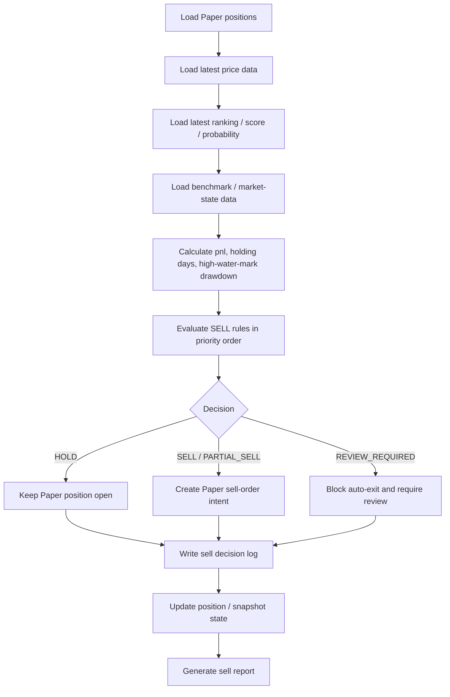

# Limited SELL / Exit Automation Design

> 문서 역할: `현재 기준 문서`
>
> Phase 8-6은 실제 SELL 주문 구현이 아니라, 미국주식 제한적 BUY 자동화 이후 Paper position을 어떻게 유지/축소/청산할지에 대한 정책 설계 단계입니다.

## Purpose

This document defines the Phase 8-6 design for limited US-stock SELL / Exit automation.

The goal is not to connect directly to broker execution. The goal is to define:

- SELL / Exit rule categories
- rule priority and conflict handling
- Paper position data structures
- SELL decision logging structure
- SELL report fields
- BUY / SELL conflict policy
- conservative LIVE transition notes

## Non-Goals

- real SELL order submission
- broker API calls
- real account balance or position lookup
- LIVE SELL activation
- scheduler-level real SELL release

## Design Principles

### Exit Safety First

SELL automation must prioritize:

- loss limitation
- traceability
- state consistency
- operator reviewability

### BUY And SELL Separation

- BUY automation decides new entry
- SELL automation decides whether an existing Paper position should remain open or be reduced/closed
- both flows must remain independently runnable

### Fail-Safe Does Not Always Mean SELL

If data is missing or position state is uncertain:

- do not assume a real SELL should happen
- Paper stage may mark `REVIEW_REQUIRED` or `SELL_DECISION_BLOCKED`
- future LIVE stage should default to stopping automation and requiring manual review

## Exit Strategy Types

## Stop Loss

Purpose:

- cap downside when a position loses too much from entry

Required data:

- entry price
- latest price
- remaining quantity

Decision basis:

- unrealized return from average entry price

Suggested default threshold:

- `US_SELL_STOP_LOSS_PCT=-0.08`

Partial sell:

- not recommended as default

Full sell:

- yes

Paper log fields:

- unrealized return
- threshold
- trigger timestamp

LIVE note:

- must not become a blind market order

## Take Profit

Purpose:

- lock in gains after a defined profit target

Required data:

- entry price
- latest price
- unrealized return

Decision basis:

- unrealized return above target

Suggested default threshold:

- `US_SELL_TAKE_PROFIT_PCT=0.15`

Partial sell:

- optional

Full sell:

- allowed when partial mode is disabled

LIVE note:

- must not conflict silently with trailing-stop logic

## Trailing Stop

Purpose:

- protect gains after a position has moved up

Required data:

- highest price since entry
- latest price

Decision basis:

- drawdown from highest price since entry

Suggested default threshold:

- `US_SELL_TRAILING_STOP_PCT=0.10`

Partial sell:

- optional later

Full sell:

- yes for initial design

## Time-Based Exit

Purpose:

- prevent stale holdings from remaining open indefinitely

Required data:

- entry trade date
- evaluation date

Decision basis:

- holding days exceed threshold

Suggested default threshold:

- `US_SELL_MAX_HOLDING_DAYS=60`

## Rank-Based Exit

Purpose:

- exit when the original BUY thesis weakens materially in the ranking model

Required data:

- latest rank
- latest score
- latest grade

Decision basis:

- rank falls below threshold or score/grade deteriorates below holdable state

Suggested defaults:

- `US_SELL_RANK_EXIT_THRESHOLD=30`
- `US_SELL_MIN_SCORE_HOLD=0.50`
- `US_SELL_MIN_PROB_HOLD=0.50`

## Benchmark-Relative Exit

Purpose:

- cut positions that materially underperform the benchmark

Required data:

- symbol return since entry
- benchmark return since entry

Decision basis:

- excess return falls below threshold

Suggested defaults:

- `US_SELL_BENCHMARK_SYMBOL=SPY`
- `US_SELL_BENCHMARK_UNDERPERFORM_PCT=-0.05`

## Risk-Off Exit

Purpose:

- reduce exposure during broad market stress

Required data:

- SPY/QQQ drawdown or market regime
- volatility proxy

Decision basis:

- market-wide risk-off signal

Suggested defaults:

- `US_SELL_RISK_OFF_EXIT_ENABLED=1`
- `US_SELL_MARKET_DRAWDOWN_EXIT_PCT=-0.05`

## Data-Quality Exit

Purpose:

- define what happens when inputs are too weak to trust an Exit rule

Required data:

- latest price
- latest ranking snapshot
- benchmark inputs

Suggested default behavior:

- `REVIEW_REQUIRED` or `SELL_DECISION_BLOCKED`
- not automatic SELL by default

## Suggested Default ENV

## Immediately Usable Design ENV

- `US_SELL_AUTOMATION_MODE=SHADOW`
- `US_SELL_AUTOMATION_ENABLED=0`
- `US_SELL_STOP_LOSS_PCT=-8`
- `US_SELL_TAKE_PROFIT_PCT=15`
- `US_SELL_TRAILING_STOP_PCT=10`
- `US_SELL_MAX_HOLDING_DAYS=60`
- `US_SELL_RANK_EXIT_THRESHOLD=30`
- `US_SELL_MIN_SCORE_HOLD=0.50`
- `US_SELL_REQUIRE_BENCHMARK_STRENGTH=1`
- `US_SELL_BENCHMARK_SYMBOL=SPY`
- `US_SELL_BENCHMARK_UNDERPERFORM_PCT=-5`
- `US_SELL_RISK_OFF_EXIT_ENABLED=1`
- `US_SELL_MARKET_DRAWDOWN_EXIT_PCT=-5`
- `US_SELL_FAILSAFE_ON_DATA_ERROR=1`

## Paper-Position-Dependent ENV

- `US_SELL_MIN_PROB_HOLD`
- `US_SELL_PARTIAL_TAKE_PROFIT_ENABLED`
- `US_SELL_PARTIAL_TAKE_PROFIT_RATIO`
- `US_SELL_COOLDOWN_AFTER_EXIT_DAYS`

## LIVE-Only Future ENV

- `US_SELL_LIVE_ENABLED`
- `US_SELL_REQUIRE_MANUAL_APPROVAL`
- `US_SELL_REQUIRE_RECON_OK`
- `US_SELL_REQUIRE_OPS_HEALTH_BELOW`

## SELL Decision Priority

Recommended priority order:

1. `DATA_ERROR / POSITION_ERROR`
2. `RISK_OFF_MARKET_EXIT`
3. `STOP_LOSS`
4. `TRAILING_STOP`
5. `MAX_HOLDING_DAYS`
6. `RANK_SCORE_DETERIORATION`
7. `BENCHMARK_UNDERPERFORMANCE`
8. `TAKE_PROFIT`
9. `HOLD`

Priority rules:

- highest-priority triggered rule wins
- if both partial and full exit triggers appear, full exit wins
- `DATA_ERROR` does not automatically mean `SELL`; it can become `REVIEW_REQUIRED`
- `HOLD` is valid only when no higher-priority rule is active
- inconsistent position state defaults to `REVIEW_REQUIRED`

## Proposed Paper Position Tables

## `trade.us_paper_position`

Suggested columns:

- `paper_position_id`
- `account_id`
- `symbol`
- `entry_trade_date`
- `entry_price`
- `quantity`
- `remaining_quantity`
- `avg_entry_price`
- `latest_price`
- `highest_price_since_entry`
- `unrealized_pnl`
- `unrealized_pnl_pct`
- `holding_days`
- `status`
- `exit_reason`
- `created_at`
- `updated_at`

## `trade.us_paper_position_snapshot`

Suggested columns:

- `snapshot_id`
- `snapshot_date`
- `paper_position_id`
- `symbol`
- `latest_price`
- `remaining_quantity`
- `highest_price_since_entry`
- `unrealized_pnl`
- `unrealized_pnl_pct`
- `holding_days`
- `status`
- `created_at`

## `trade.us_sell_decision_log`

Suggested columns:

- `sell_decision_id`
- `trade_date`
- `account_id`
- `automation_mode`
- `paper_position_id`
- `symbol`
- `decision`
- `sell_action`
- `sell_ratio`
- `sell_quantity`
- `exit_reason`
- `review_required`
- `applied_rules JSONB`
- `decision_reason_detail`
- `created_at`

## `trade.us_sell_signal_log`

Suggested columns:

- `sell_signal_id`
- `trade_date`
- `paper_position_id`
- `symbol`
- `rule_name`
- `rule_result`
- `metric_value`
- `threshold_value`
- `severity`
- `detail`
- `created_at`

## `trade.us_paper_sell_order`

Suggested columns:

- `paper_sell_order_id`
- `trade_date`
- `paper_position_id`
- `symbol`
- `side`
- `sell_ratio`
- `sell_quantity`
- `sell_price_ref`
- `assumed_fill_status`
- `source_sell_decision_id`
- `created_at`
- `updated_at`

## SELL Decision Flow



## Decision Result Shape

```python
{
    "symbol": "AAPL",
    "paper_position_id": "uuid",
    "decision": "HOLD",
    "sell_action": "NONE",
    "sell_ratio": 0.0,
    "sell_quantity": 0,
    "exit_reason": None,
    "review_required": False,
    "applied_rules": [
        {"rule": "STOP_LOSS", "result": "PASS", "value": -0.032, "threshold": -0.08},
        {"rule": "MAX_HOLDING_DAYS", "result": "PASS", "value": 14, "threshold": 60},
    ],
}
```

## BUY / SELL Conflict Policy

- BUY automation is for new entry only
- SELL automation is for existing Paper positions only
- existing position should block additional BUY by default
- same-day SELL signal should block same-day new BUY on the same symbol
- if BUY and SELL conflict, SELL / REVIEW_REQUIRED takes precedence
- after full exit, a cooldown window should apply before re-entry

## Future SELL Report Fields

- evaluation date
- open Paper position count
- HOLD count
- SELL count
- PARTIAL_SELL count
- REVIEW_REQUIRED count
- symbol
- entry price
- latest price
- highest price since entry
- unrealized pnl
- holding days
- exit reason
- applied rules
- realized paper pnl
- unrealized paper pnl
- benchmark-relative performance

## LIVE Transition Notes

- SELL automation must remain separate from BUY readiness
- LIVE SELL must keep manual approval and risk gates
- data error must not become a blind liquidation rule

## Known Limitations

- no SELL execution code exists in this phase
- current Paper lifecycle may need stronger position-state persistence before automated SELL evaluation
- trailing stop requires stable `highest_price_since_entry` persistence
- realized pnl is incomplete until a Paper SELL lifecycle exists

## Next TODO

Phase 8-7 should focus on:

- SELL / HOLD / REVIEW_REQUIRED skeleton implementation
- Paper position builder and snapshot persistence
- sell decision log and sell report generation
- BUY / SELL same-day conflict handling in code
